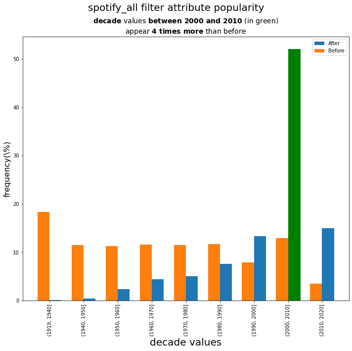
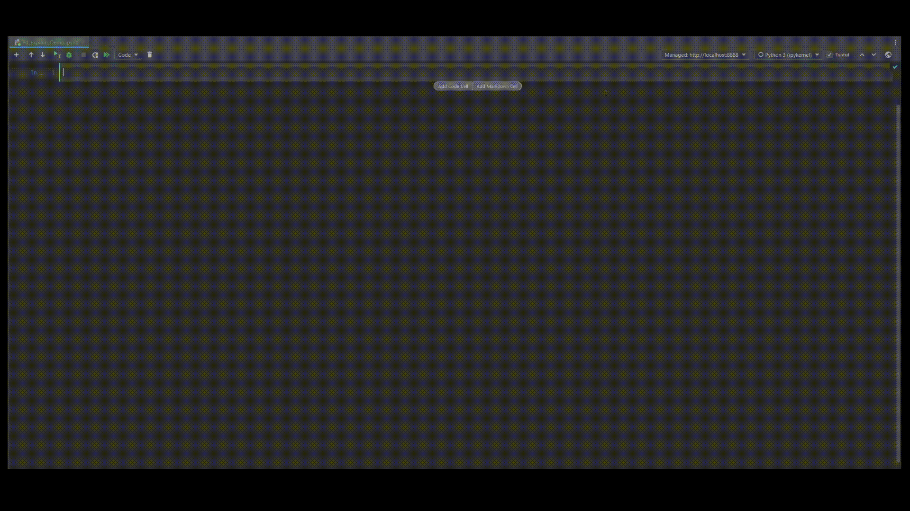

Pd Explain
=======================================

**pd_explain**  is a Python library that create explanation for dataframes manipulations,
using pandas dataframes and explanations based on
`ExplainED: Explanations for EDA Notebooks <https://github.com/TAU-DB/ExplainED>`_

.. contents::

Installation
=======================================
Install pd-explain with pip by https or ssh

.. code-block:: console

  pip install git+https://github.com/edenIsakov/pd-explain.git@master
  pip install git+ssh://git@github.com/edenIsakov/pd-explain.git

Usage
=======================================
You can use explain dataframe in different ways

read from csv (or any other read function in pandas)
-------------------------------------------------------

.. code-block:: python

    import pandas as pd
    import pd_explain
    # by importing pd_explain all read functions create explainable dataframe
    pd.read_csv(r"your_data.csv")

create your own data frame
-----------------------------
.. code-block:: python

    import pandas as pd
    import pd_explain
    d = {'col1': [1, 2], 'col2': [3, 4]}
    df = pd.DataFrame(data=d)
    # explicit convert dataframe to explainable
    df = pd_explain.to_explainable(df)

Now you can use any dataframe manipulations
and use explain to get explanation about what interesting in the result

.. code-block:: python

    import pandas as pd
    import pd_explain
    spotify_all = pd.read_csv(r'Datasets\spotify_all.csv')
    popular = spotify_all[spotify_all.popularity > 65]
    popular.explain()

For this popularity filter the explanation was

Demo
=======================================

`Full example Notebook`_

`Demo Spotify example`_

.. _Full example Notebook: docs/source/notebooks/Bank_Churners_Pitch.ipynb
.. _Demo Spotify example: docs/source/notebooks/Demo.ipynb

Documentation
=======================================
`Documentation <https://stirring-medovik-ba9b36.netlify.app/src/pd_explain.html>`_

Articles
=======================================
`ExplainED: Explanations for EDA Notebooks <https://github.com/TAU-DB/ExplainED>`_

Authors
=======================================
- `@Eden Isakov <https://github.com/edenIsakov>`_
