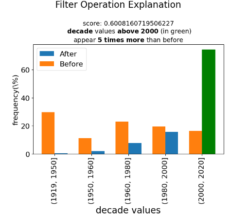

.. _explain-function - Filter:

Explain Function - Filter
===================

The `explain` function in the `ExpDataFrame` class generates explanations for a filtered or grouped DataFrame. It provides insights into how a series of operations led to the resulting DataFrame, making it easier to understand and interpret data transformations.

Method Signature
------------------

.. code-block:: python

    ExpDataFrame.explain(
        self,
        schema: dict = None,
        attributes: List = None,
        top_k: int = 1,
        figs_in_row: int = 2,
        show_scores: bool = False,
        title: str = None,
        corr_TH: float = 0.7
    ) -> ExplanationFigures

Parameters
----------------

- ``schema`` (dict, optional): A dictionary specifying result column names and any ignored columns. Default is ``None``.
- ``attributes`` (List, optional): A list of specific columns to consider in the explanation. Default is ``None`` (all attributes).
- ``top_k`` (int, optional): The number of explanations to generate. Default is ``1``.
- ``figs_in_row`` (int, optional): The number of explanation figures to display in one row. Default is ``2``.
- ``show_scores`` (bool, optional): Whether to display scores on the explanation figures. Default is ``False``.
- ``title`` (str, optional): A title for the explanation. Default is ``None``.
- ``corr_TH`` (float, optional): The threshold for correlation between features. Default is ``0.7``.

Filter Usage Example with "spotify_all" DataFrame
----------------

.. code-block:: python

    # Import the necessary libraries
    import pandas as pd
    from pd_explain

    spotify_all = pd.read_csv(r'C:\spotify_all.csv', encoding = 'latin-1')
    # This DataFrame contains data related to Spotify tracks

    # Apply a filter operation
    filtered_df = spotify_all[spotify_all.popularity > 70]

    # Generate an explanation for the filter operation
    filtered_df.explain(
        title='Filter Operation Explanation',
        show_scores=True
    )

**Output:**

### Output Description

The output illustrates the impact of the "high popularity" filter on the "spotify_all" dataset. After applying the filter, the visualization shows a significant increase in the percentage of songs from the last two decades, indicating a clear influence on the composition of the resulting dataset.
Songs that have gained popularity in recent years are more likely to meet this criterion, as they tend to accumulate higher streaming numbers and recognition. Consequently, the filter narrows down the dataset to include primarily contemporary tracks, leading to the observed shift in the composition of the dataset towards more recent music.

Expected Output
----------------

The code above generates an explanation figure(s) showcasing how track popularity was filtered, the impact of the filter operation on the data. Scores, if enabled, will also be displayed.

This demonstrates how to use the `explain` function with a real-world dataset to gain insights into your data transformations.
