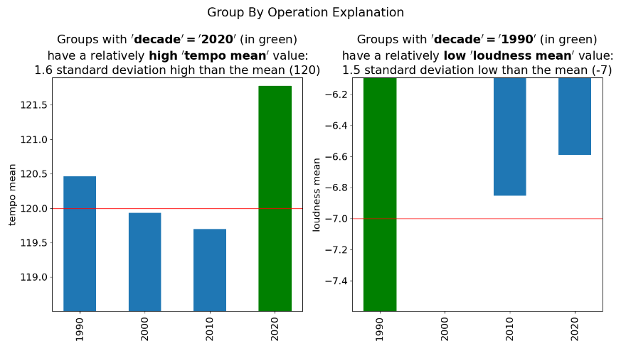

.. _explain-function-group-by:

Explain Function - Group By
===========================

The `explain` function in the `ExpDataFrameGroupBy` class generates explanations for a grouped DataFrame. It provides insights of a grouped DataFrame, making it easier to understand and interpret data transformations.

Group By Usage Example with "spotify_all" DataFrame
---------------------------------------------------

.. code-block:: python

    # Import the necessary libraries
    import pandas as pd
    import pd_explain

    # Load the "spotify_all" DataFrame
    spotify_all = pd.read_csv(r'C:\spotify_all.csv', encoding='latin-1')

    # Perform a group by operation
    grouped_data = spotify_all.groupby('decade').mean()

    # Generate an explanation for the group by operation
    grouped_data.explain(
        title='Group By Operation Explanation',
        top_k=2,
        figs_in_row=2
    )

**Output:**

Output Description
------------------

The output illustrates the impact of the "Group By" operation on the "spotify_all" dataset. After applying the group-by operation to calculate the mean popularity by artist, the visualization shows the mean popularity for each artist.

Scores, if enabled, will also be displayed, providing additional insights into the grouped data.

Additional Group By Usage Example with "spotify_all" DataFrame
--------------------------------------------------------------

.. code-block:: python

    # Perform another group by operation
    grouped_data = spotify_all.groupby('year')['duration_ms'].mean()

    # Generate an explanation for the group by operation
    grouped_data.explain(
        title='Group By Operation Explanation',
        show_scores=True
    )

**Output:**

.. image:: groupby2.png

Output Description
------------------

This additional output illustrates the impact of another "Group By" operation on the "spotify_all" dataset. In this case, the group-by operation calculates the mean duration in milliseconds by year. The visualization displays the mean duration for each year.

Scores, if enabled, will provide further details on the groupings.

Expected Output
----------------

The code above generates explanation figure(s) showcasing how data was grouped and aggregated, the impact of the group-by operation on the data, and the calculated values for each group. Scores, if enabled, will offer additional insights into the groupings.

These examples demonstrate how to use the `explain` function with a real-world dataset to gain insights into your data transformations during group-by operations.
