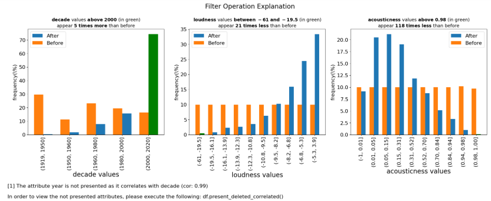
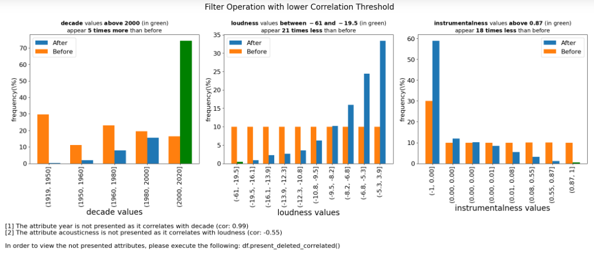
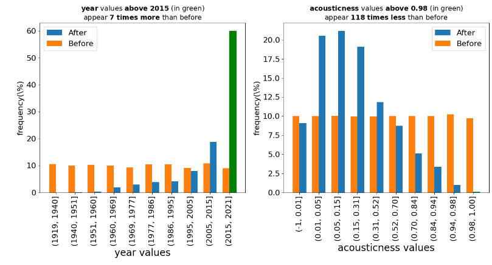

.. _parameter-details:

Parameter Details
==================

In this section, we'll explore additional parameters and functions in the **pd-explain** library to further enhance your data exploration and explanation capabilities.

Using the "top_k", "figs_in_row" Parameters
---------------------------

The "top_k" parameter allows you to control the number of explanations generated by the `explain` function. In this example, we apply a filter operation on the "spotify_all" DataFrame, setting the "top_k" parameter to 3. This parameter expands the explanations to the top 3 results.

.. code-block:: python

    # Assuming you have already loaded the "spotify_all" DataFrame and filtered it by popularity

    # Generate an explanation with top 3 results
    filtered_df.explain(
        title='Filter Operation Explanation',
        top_k=3,  # Set top_k parameter to 3
        figs_in_row=3 # Set number of figures in a row to 3
    )

**Output:**
Three explanation figures will be generated, displaying the top 3 explanations based on the filter operation's impact on the data.

Please note that the attribute "year" is not presented as it correlate with "decade".
In that case, pd-explain choses the more significant attribute and deletes the other.

Controlling Correlation with "corr_TH"
---------------------------------------

The "corr_TH" parameter allows you to set a threshold for correlation between features. In this example, we use the parameter to specify the threshold for correlation, ensuring that only one of the features correlates more than it will considered in the explanation.

.. code-block:: python

    # Continue from the previous code
    # Set a threshold for correlation
    corr_threshold = 0.5

    # Generate an explanation with "corr_TH" set to the threshold
    filtered_df.explain(
        title='Filter Operation with lower Correlation Threshold',
        top_k=3,
        figs_in_row=3,
        corr_TH=corr_threshold  # Set corr_TH parameter to the threshold
    )

**Expected Output:**
The code will generate explanation figures that not consider highly correlated features, helping you focus on the most relevant aspects of the data.

Presenting Deleted Correlations
-------------------------------

The `present_deleted_correlated` function allows you to generate explanations for features that were removed as they correlated with other features displayed before in the explanation.

**Method Signature:**

.. code-block:: python

    ExpDataFrame.present_deleted_correlated(figs_in_row: int = 2) -> ExplanationFigures

**Parameters:**

- `figs_in_row` (int, optional): The number of explanation figures to display in one row. Default is `2`.

.. code-block:: python

    # Continue from the previous code
    # Generate explanations for deleted correlated features
    filtered_df.present_deleted_correlated(figs_in_row=2)

**Expected Output:**
The output will include explanation figures showcasing the features that were removed due to their correlation with other displayed features. This function aids in understanding the impact of correlation-based feature selection on your data.

Explore these additional parameters and functions to gain finer control and insights into your data exploration and explanation tasks.
